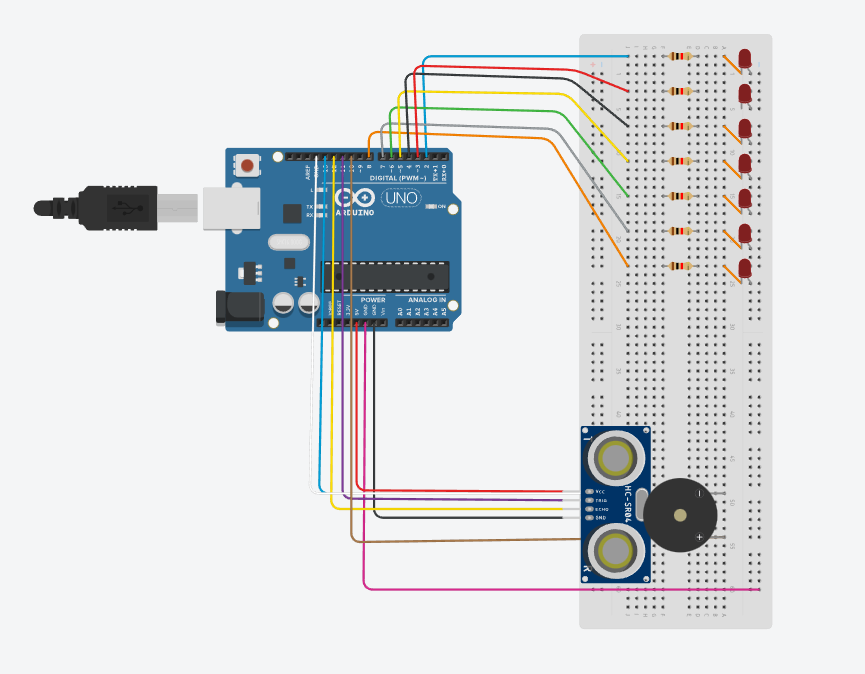
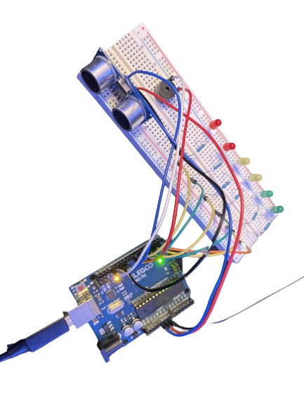
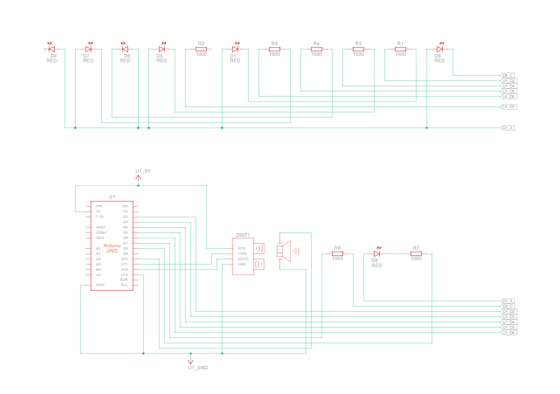

# Motion Detection System (Arduino)

## Overview
- Motion detection for home automation using an ultrasonic sensor and relay control
- Local server + web dashboard for real-time monitoring and control
- Component messaging for synchronized data/commands

## Implementation
- Moving-average filtering (5-sample window) and temperature compensation for distance measurements
- UART serial link with fixed-size buffers between microcontroller and server
- Flask REST API for JSON sensor data; MQTT (Mosquitto) publish/subscribe for sensor + relay commands
- Web dashboard with Chart.js + WebSockets (AJAX for API requests)
- Nginx reverse proxy for HTTP routing, SSL termination, and performance tuning (caching/load handling)

## Hardware and Build

<table>
  <tr>
    <td align="center" width="33%" valign="top">
      
      

      Wiring diagram
    </td>
    <td align="center" width="33%" valign="top">
      
      

      Physical prototype
    </td>
    <td align="center" width="33%" valign="top">
      
      

      Schematic
    </td>
  </tr>
</table>

