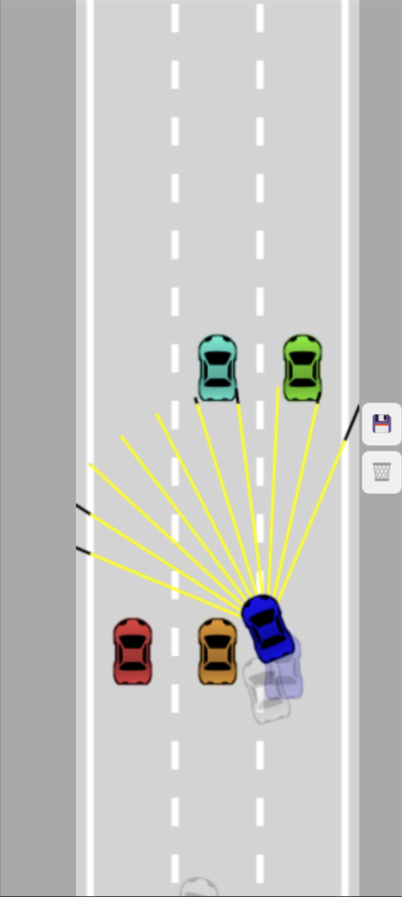
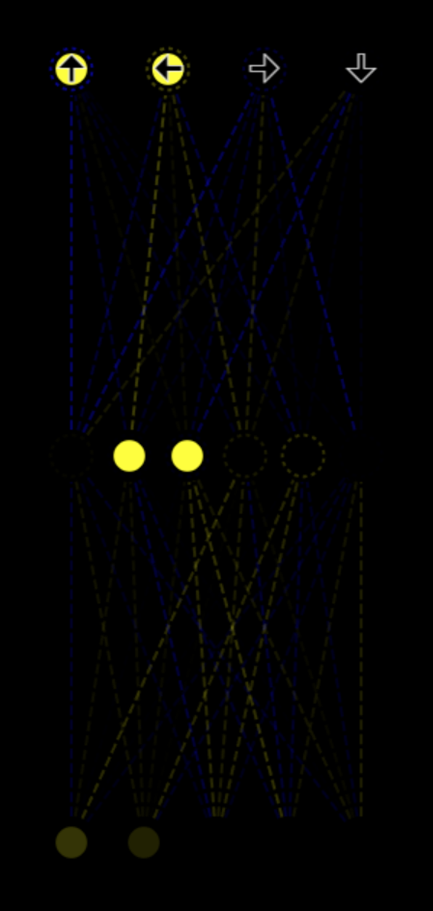
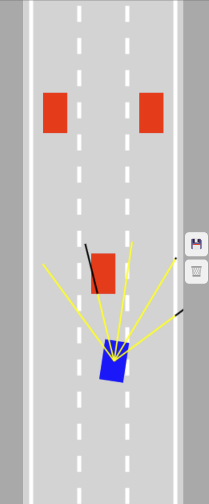
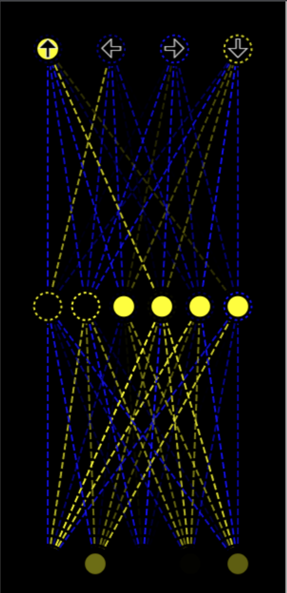

# Self-Driving Car Simulation

## Overview
- Browser-based self-driving car simulation using ray-casting sensors for perception and a lightweight neural network for control
- Genetic algorithm optimization (mutation + crossover) for gradient-free tuning of network weights/biases
- Visualization tools for sensor rays, collisions, and network activations to debug behavior and convergence

## Implementation
- Ray casting and line-segment intersection to convert road boundaries/traffic into normalized sensor inputs (0 to 1)
- Forward-pass neural network for steering/throttle decisions; fitness-based selection to optimize driving performance
- Collision detection via polygon intersection with bounding-box rejection for faster checks

## Contents
- `index.html`, `style.css` - UI and rendering
- `main.js` - Simulation loop and orchestration
- `network.js` - Neural network model + genetic operators
- `sensor.js`, `road.js`, `car.js`, `controls.js`, `utils.js` - Core simulation components
- `visualizer.js` - Network/sensor visualization
- `car.png` - Vehicle sprite

## Images

<table>
  <tr>
    <td align="center" width="50%">
      
       
      Ray-cast sensors (scenario A)
    </td>
    <td align="center" width="50%">
      
       
      Network activations (scenario A)
    </td>
  </tr>
  <tr>
    <td align="center" width="50%">
      
       
      Ray-cast sensors (scenario B)
    </td>
    <td align="center" width="50%">
      
       
      Network activations (scenario B)
    </td>
  </tr>
</table>
