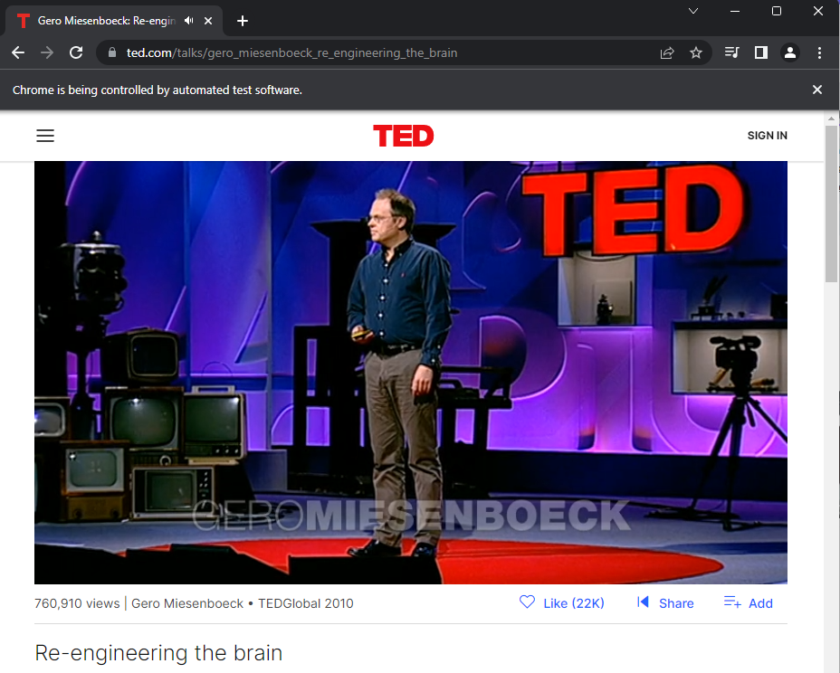
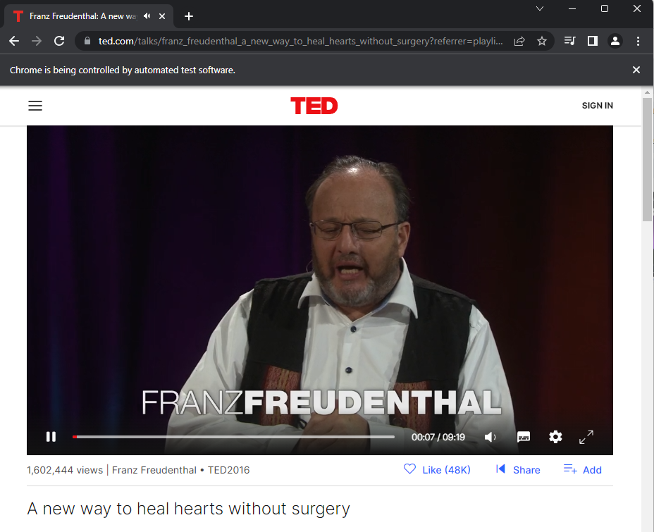
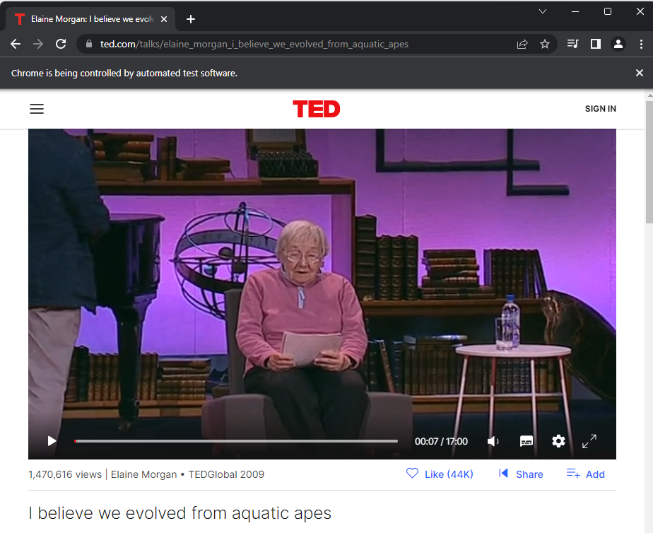
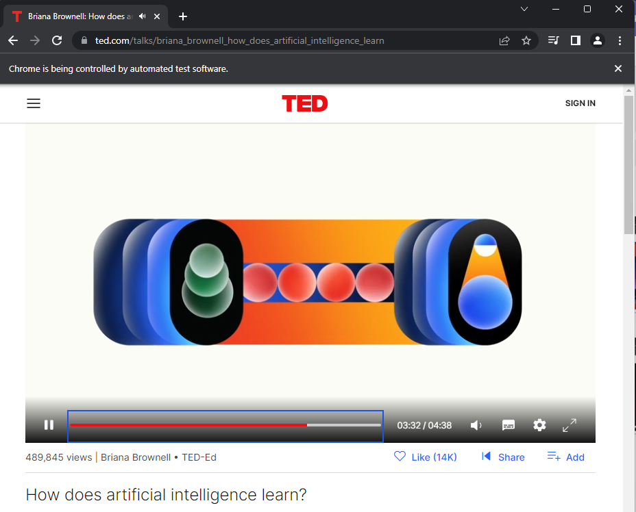

# TED Talk Search Automation (Python + Selenium)

## Overview
Selenium WebDriver script that automates TED’s search flow: accepts a user topic, submits a query on TED Talks, and opens a result.

## Functionality
- CLI prompt for a search topic
- Launches Chrome via ChromeDriver
- Searches on `ted.com/talks`
- Clicks into a talk from the results (selector-dependent)

## Requirements
- Python 3.x
- Google Chrome
- ChromeDriver (must match your Chrome version)
- Selenium

## Install & Run
- pip install selenium
- python main.py

## ChromeDriver
Either:
- Add `chromedriver` / `chromedriver.exe` to PATH, or
- Set an absolute driver path in `main.py`, e.g.
  `PATH = "C:\\Program Files (x86)\\chromedriver.exe"`

## Known Issues
- TED’s DOM/class names change frequently. If you see `NoSuchElementException`, update the `By.NAME` / `By.CLASS_NAME` selectors.
- The script uses `time.sleep`; replace with `WebDriverWait` for reliability.
- Ensure the start URL is valid (recommended: `https://www.ted.com/talks`).

## Example Runs

<table>
  <tr>
    <td></td>
    <td></td>
  </tr>
  <tr>
    <td></td>
    <td></td>
  </tr>
</table>

