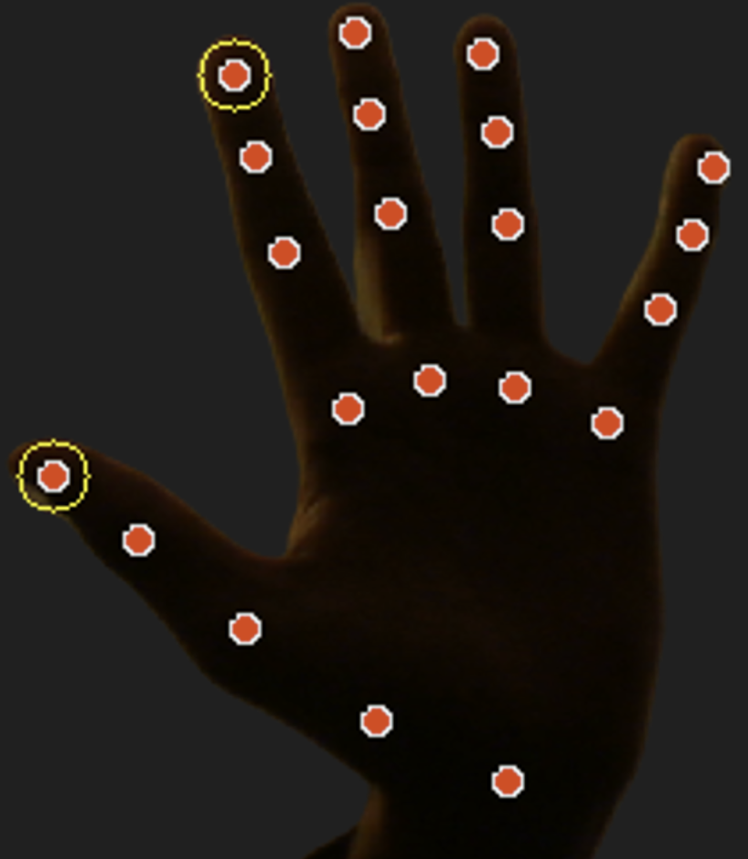

# Virtual Mouse

Computer-vision virtual mouse controlled by hand landmarks from a webcam feed.

## Overview
- Tracks a hand in real time with MediaPipe and maps the index-fingertip position to screen coordinates.
- Uses OpenCV for frame capture/processing and PyAutoGUI for OS cursor control.

## Implementation
- Webcam frames are flipped and converted BGR -> RGB, then passed to `mp.solutions.hands.Hands()` for landmark detection.
- Cursor mapping: index fingertip (landmark id `8`) is scaled from camera pixel space to screen space using `pyautogui.size()`.
- Gestures:
  - Click: index tip y vs thumb tip y (landmark id `4`) distance threshold (`abs(index_y - thumb_y) < 20`) triggers `pyautogui.click()`.
  - Move: `abs(index_y - thumb_y) < 100` triggers `pyautogui.moveTo(index_x, index_y)`.

## Requirements
- Python
- `opencv-python`
- `mediapipe`
- `pyautogui`

## Contents
- `main.py` - Webcam hand tracking and gesture-to-mouse control loop.

## Notes
- This moves and clicks your real system cursor. Run only when you can safely control the pointer.
- Thresholds (`20`, `100`) depend on camera FOV, resolution, and hand distance. Adjust as needed.

## Example

